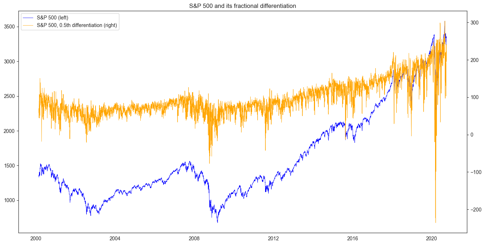
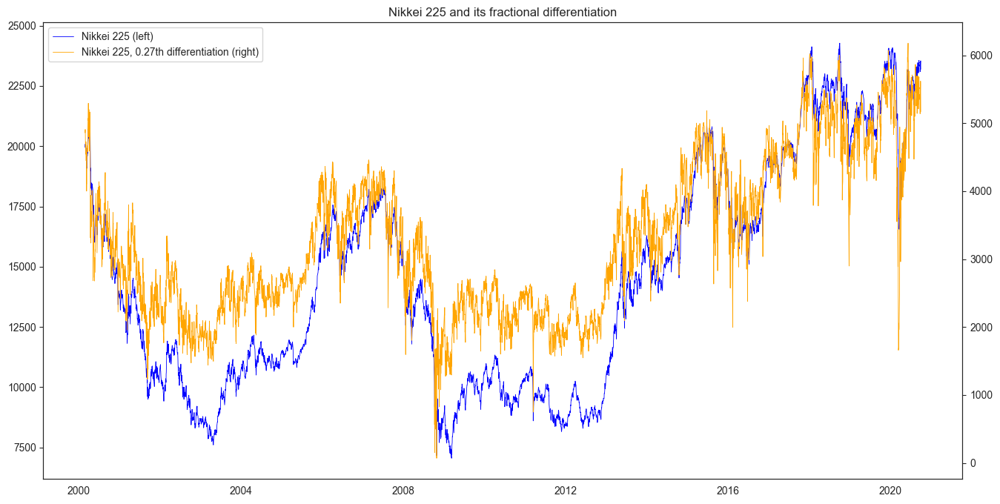

# Fracdiff: Super-fast fractional differentiation

[](https://pypi.org/project/fracdiff)
[](https://pypi.org/project/fracdiff)
[](https://travis-ci.com/simaki/fracdiff)
[](https://codecov.io/gh/simaki/fracdiff)
[](https://pypi.org/project/fracdiff)
[](LICENSE)
[](https://github.com/psf/black)

Python library to perform fractional differentiation of time-series,
a la "Advances in Financial Machine Learning" by M. Prado.
Fracdiff processes time-series to be stationary while preserving memory.



## Installation

```sh
$ pip install fracdiff
```

## Features

Fracdiff is a Python library to perform fractional differentiation of time-series.
Fractional differentiation preprocesses time-series to a stationary one while preserving the memory in the original series.

- `fdiff`: A function which extends [`numpy.diff`](https://numpy.org/doc/stable/reference/generated/numpy.diff.html) to a fractional order.
- `Fracdiff`: Transformer to perform fractional differentiation of time-series. Compatible with scikit-learn API.
- `FracdiffStat`: Transformer to make fractionally differentiated time-series are stationary while preserving maximum memory. Compatible with scikit-learn API.

## What is fractional differentiation?

See [M. L. Prado, "Advances in Financial Machine Learning"][prado].

## How to use [](https://colab.research.google.com/github/simaki/fracdiff/blob/master/sample/howto/howto.ipynb)

### Fractional differentiation

A function `fdiff` calculates fractional differentiation.
This is an extension of `numpy.diff` to a fractional order.

```python
import numpy as np
from fracdiff import fdiff

a = np.array([1, 2, 4, 7, 0])
fdiff(a, n=0.5)
# array([ 1.       ,  1.5      ,  2.875    ,  4.6875   , -4.1640625])
np.array_equal(fdiff(a, n=1), np.diff(a, n=1))
# True

a = np.array([[1, 3, 6, 10], [0, 5, 6, 8]])
fdiff(a, n=0.5, axis=0)
# array([[ 1. ,  3. ,  6. , 10. ],
#        [-0.5,  3.5,  3. ,  3. ]])
fdiff(a, n=0.5, axis=-1)
# array([[1.    , 2.5   , 4.375 , 6.5625],
#        [0.    , 5.    , 3.5   , 4.375 ]])
```

### Preprocessing by fractional differentiation

A transformer class `Fracdiff` performs fractional differentiation by its method `transform`.

```python
from fracdiff import Fracdiff

X = ...  # Time-series

f = Fracdiff(0.5)
X = f.fit_transform(X)
```

For example, 0.5th differentiation of S&P 500 historical price looks like this:


`Fracdiff` is compatible with scikit-learn API.
One can imcorporate it into a pipeline.

```python
from sklearn.linear_model import LinearRegression
from sklearn.preprocessing import StandardScaler
from sklearn.pipeline import Pipeline

X, y = ...  # Dataset

pipeline = Pipeline([
    ('scaler', StandardScaler()),
    ('fracdiff', Fracdiff(0.5)),
    ('regressor', LinearRegression()),
])
pipeline.fit(X, y)
```

### Fractional differentiation while preserving memory

A transformer class `FracdiffStat` finds the minumum order of fractional differentiation that makes time-series stationary.
Differentiated time-series with this order is obtained by subsequently applying `transform` method.
This series is interpreted as a stationary time-series keeping the maximum memory of the original time-series.

```python
from fracdiff import FracdiffStat

X = ...  # Fetch 1d array of Nikkei 225 historical price

f = FracdiffStat()
X = f.fit_transform(X)
f.d_
# array([0.71875 , 0.609375, 0.515625])
```

The result for Nikkei 225 index historical price looks like this:



Other examples are provided [here](sample/examples/examples.ipynb).

Example solutions of exercises in Section 5 of "Advances in Financial Machine Learning" are provided [here](sample/exercise/exercise.ipynb).

## References

- [Marcos Lopez de Prado, "Advances in Financial Machine Learning", Wiley, (2018).][prado]

[prado]: https://www.wiley.com/en-us/Advances+in+Financial+Machine+Learning-p-9781119482086
